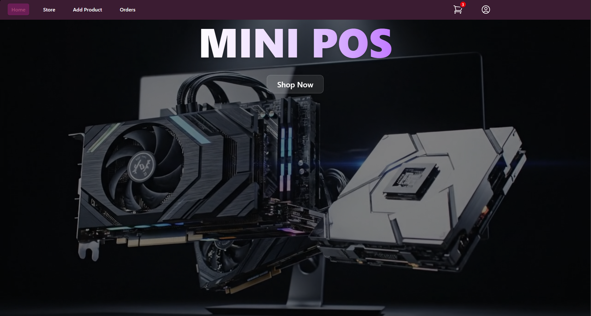
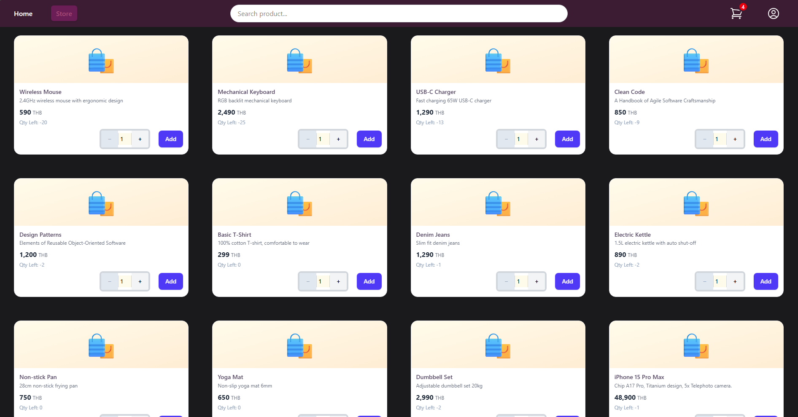
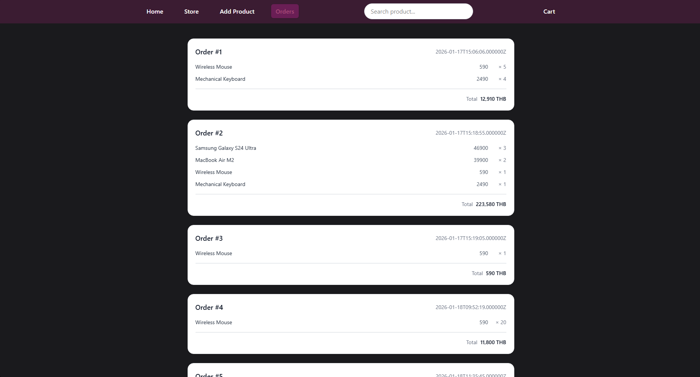

# Mini POS System 🛒


**Mini POS** is a personal practice project created to study the integration between **Modern Angular** (Frontend) and **Laravel** (Backend). I built this application to apply what I've learned about state management and database operations in a practical scenario.



## 💡 Why I Built This: Self-Learning Journey

> *"The best way to learn is to build something real."*

As a self-learner, I wanted to move beyond basic tutorials and static mock data. I created this project to challenge myself with actual business logic and to better understand how a full-stack application works. My main learning goals were:
1.  **Explore Modern Angular:** To get hands-on experience with the new **Signals API** and **RxJS** and see how they solve state management problems.
2.  **Practice Backend Logic:** To learn how to safely handle data updates (like stock deduction) using **Database Transactions** in Laravel.
3.  **Connect the Stack:** To understand the flow of data between a separate Frontend and Backend API.
   
## 🌟 Key Features

* **⚡ Reactive Product Filter:**
    * Instantly filter products by **Category** and **Search Keyword** simultaneously.
    * Powered by `RxJS` (combineLatest) and `Signals` for optimal performance.
      
* **🛒 Smart Shopping Cart:**
    * Real-time calculation of Subtotal, Total Items, and Grand Total.
    * Built entirely with **Angular Signals** (`computed`, `update`) for fine-grained reactivity (No `ngOnChanges` needed).
* **🛡️ Secure Transactions:**
    * Laravel Backend uses `DB::transaction` to ensure atomic operations (Order Creation + Stock Deduction).
    * Rollbacks automatically if any part of the process fails.
    
* **📝 Product Management:**
    * Add new products using **Reactive Forms** with comprehensive validation.

## 🛠️ Tech Stack

### Frontend (Angular 17+)
* **Core:** Standalone Components, Signals, RxJS
* **State Management:** Hybrid (Signals for View State, RxJS for Async Streams)
* **Forms:** Reactive Forms (`FormGroup`, `FormControl`, `Validators`)
* **HTTP:** Angular HttpClient (Interfacing with Laravel API)

### Backend (Laravel 11+)
* **API:** RESTful API Routes
* **Database:** MySQL (Relational Schema: Categories -> Products -> OrderItems <- Orders)
* **Security:** CSRF Protection, Input Validation (`FormRequest`)
* **Logic:** Eloquent ORM, Database Transactions

## 🚀 Installation & Setup

This project consists of two parts: the Laravel Backend and the Angular Frontend.

### Backend Setup (Laravel)

1.  **Clone the Repository**
    ```bash
    git clone [YOUR_GITHUB_REPO_URL]
    cd mini-pos-backend
    ```

2.  **Install PHP Dependencies**
    ```bash
    composer install
    ```

3.  **Configure Environment**
    * Copy the `.env.example` file:
        ```bash
        cp .env.example .env
        ```
    * Edit `.env` to match your MySQL credentials:
        ```env
        DB_CONNECTION=mysql
        DB_HOST=127.0.0.1
        DB_PORT=3306
        DB_DATABASE=mini_pos_db
        DB_USERNAME=root
        DB_PASSWORD=
        ```

4.  **Generate App Key & CORS**
    ```bash
    php artisan key:generate
    php artisan config:publish cors
    ```
    *(Ensure `config/cors.php` allows your Angular localhost origin)*

5.  **Database Setup**
    * Run migrations and seeders to create tables (Products, Categories) and mock data:
    ```bash
    php artisan migrate --seed
    ```

6.  **Run the Backend Server**
    ```bash
    php artisan serve
    ```
    *(API will run at http://localhost:8000)*

---

### Frontend Setup (Angular)

1.  **Navigate to Frontend Directory**
    ```bash
    cd mini-pos-frontend
    ```

2.  **Install Node Dependencies**
    ```bash
    npm install
    ```

3.  **Run the Frontend Application**
    ```bash
    ng serve
    ```

4.  **Start Selling**
    * Visit http://localhost:4200 in your browser.

## 📂 Project Structure Highlights

### Angular (Frontend)
* `src/app/services/pos.service.ts`: Central hub for API communication and Cart State management.
* `src/app/components/product-list/`: Handles product filtering and display using Signals.
* `src/app/components/cart/`: Manages cart UI and calculations.

### Laravel (Backend)
* `app/Http/Controllers/OrderController.php`: Handles order submission and stock deduction logic.
* `app/Models/Product.php`: Defines relationships with Categories and OrderItems.
* `database/migrations/`: Schemas for Products, Categories, Orders, and OrderItems.

## 🤝 Contributing

This is a personal portfolio project, but I am open to suggestions!
1.  Fork the repo.
2.  Create a feature branch (`git checkout -b feature/AmazingFeature`).
3.  Commit your changes (`git commit -m 'Add some AmazingFeature'`).
4.  Push to the branch (`git push origin feature/AmazingFeature`).
5.  Open a Pull Request.

---
**Developed by Rinriku69**
